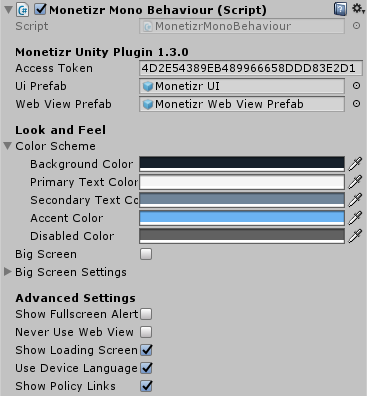
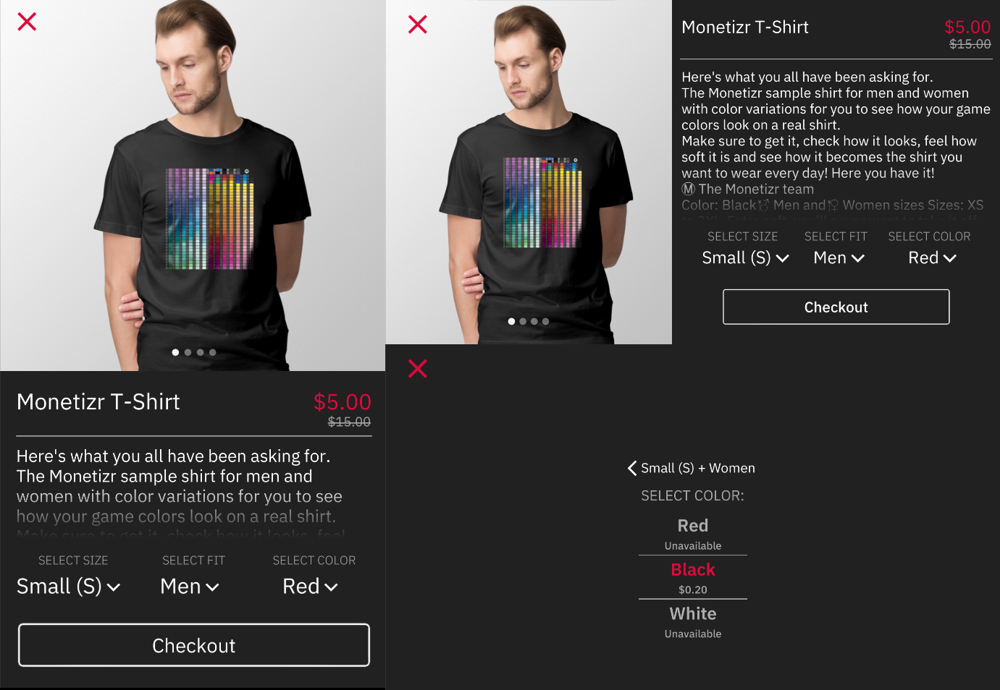

# Monetizr Unity Plugin

This plugin enables Monetizr Partners to use Monetizr in their Unity games easily, the plugin handles direct communication with our API and provides abstractions for easier usage.

### Read all about it in our [**documentation**](https://docs.themonetizr.com/docs/unity)

## Requirements
This plugin requires at least Unity 2017.2. This version was chosen for its support for screen cutouts. 5.6 and earlier are not supported, as the plugin uses UnityWebRequest features introduced in 2017.1.

## Using the plugin

### Installation

Import the provided .unitypackage in your project, or paste the Monetizr folder from the Assets folder in your project.

### Initial setup

Monetizr is implemented as a singleton prefab. You can find this prefab at **Monetizr/Prefabs/Monetizr Prefab**. You should place this in the first scene of your game, our code makes sure that there is only 1 prefab instantiated. Out-of-the-box it comes preconfigured with our test access token, which can be used to retrieve the "monetizr-sample-t-shirt" product.



#### Base prefab configuration:

 * **Access Token** - this is your oAuth Access token, provided by Monetizr
 * **UI Prefab and Web View Prefab** - should be left as is, however power users are free to customize our UIs to fit their needs.

### Showing the product
All Monetizr code is contained within the `Monetizr` namespace. All further examples are provided with the assumption that you are `using Monetizr;`. 

The plugin is written using the singleton pattern in order to simplify the workflow. At any time, you can access the current `MonetizrMonoBehaviour` with `MonetizrClient.Instance`. All functions relevant to game developers have been made as simple as possible.

You can show a product with a single line of code.
```csharp
   MonetizrClient.Instance.ShowProductForTag("monetizr-sample-t-shirt");
```

Our provided UI has been crafted to handle toughest environmental conditions, notably it scales well with all kinds of aspect ratios and supports changing between landscape and portrait without issue. Try it out, the smoothness will leave you in awe.


